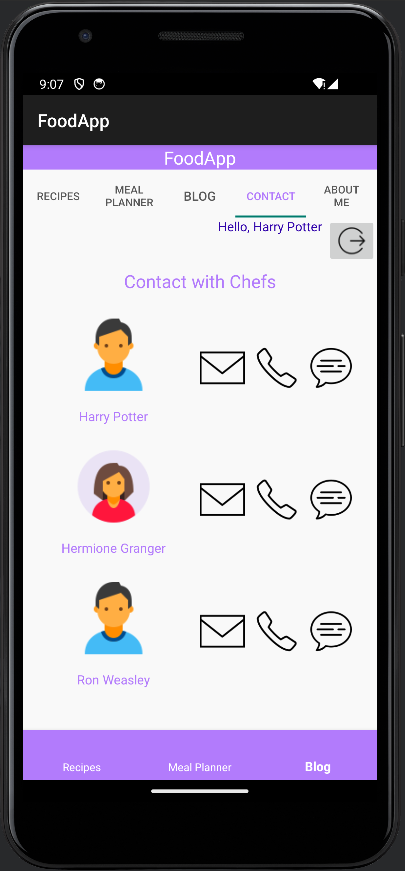

# FoodApp

A simple food application developed using Android Studio for a course project.

## Functionality

The FoodApp offers the following features:

- **Sign In**: Users can log in to access their personalized content.
- **Recipe Management**: Users can view, add, and edit recipes.
- **Meal Planning**: A meal planner helps users to organize their meals by date.
- **Blogging**: Users can create and share blogs about their culinary experiences.
- **Contact**: The app provides a way to contact the creators or other users.
- **User Profiles**: Users can view and edit their personal information in the 'About Me' section.

## Concepts Used

- **MVC Architecture**: Organizing code into Model, View, Controller for maintainability.
- **Shared Preferences**: Storing user preferences and session data.
- **Fragment Management**: Utilizing fragments to manage multiple views within a single activity.
- **RecyclerView**: Displaying lists of recipes, meal plans, and blogs efficiently.
- **AlertDialogs**: Using dialogs for user inputs and editing profiles.
- **Data Binding**: Minimizing code by binding UI components directly to data sources.

## Screenshots

